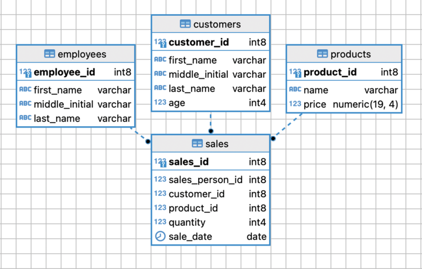

### Hexlet Program [Data analyst](https://ru.hexlet.io/programs/data-analytics)
#### [Level 1 project: Sales / Проект 1: Продажи ](https://ru.hexlet.io/programs/data-analytics/projects/92)

##### TODO:
Analyse the data from a sales platform. Start with small tables and finish with the whole database. Visualise the extracted data in Preset and make a final presentation with the results.

### Hexlet tests and linter status:

[Data in Google tables](data_analyst_l1_project_step1)

DB Model

